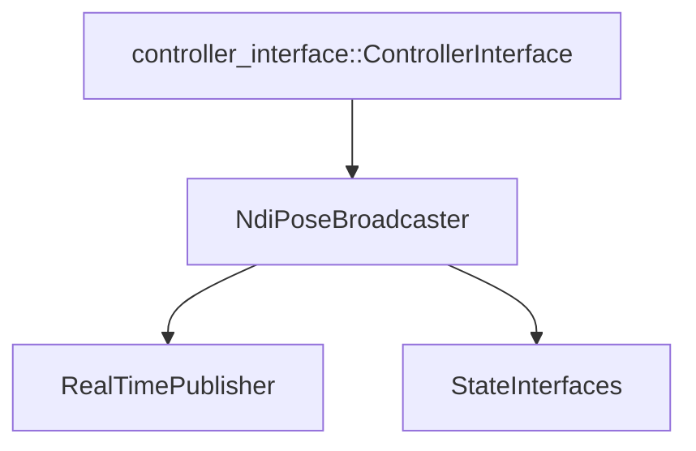

# NDI Controllers Package

## Table of Contents

1. [Overview](#overview)
2. [Components](#components)
    - [Directory Structure](#directory-structure)
    - [Class Architecture](#class-architecture)
3. [Dependencies](#dependencies)
4. [Installation](#installation)
5. [Controllers](#controllers)
    - [NdiPoseBroadcaster](#ndiposebroadcaster)
    - [Controller Plugin Definition](#controller-plugin-definition)
6. [Message Broadcasting](#message-broadcasting)
    - [Message Structure](#message-structure)
    - [Real-time Publishing](#real-time-publishing)
7. [State Interfaces](#state-interfaces)
    - [Interface Configuration](#interface-configuration)
    - [State Management](#state-management)
8. [Configuration](#configuration)
    - [Parameter Schema](#parameter-schema)
    - [Runtime Configuration](#runtime-configuration)
9. [Real-time Considerations](#real-time-considerations)
    - [Lock-free Operation](#lock-free-operation)
    - [Performance Optimization](#performance-optimization)
10. [Usage](#usage)
    - [Controller Loading](#controller-loading)
    - [Controller Configuration](#controller-configuration)
    - [Data Monitoring](#data-monitoring)
11. [Examples](#examples)
    - [Basic Controller Usage](#basic-controller-usage)
    - [Custom Message Handling](#custom-message-handling)
12. [Troubleshooting](#troubleshooting)
    - [Common Issues](#common-issues)
    - [Debugging Tools](#debugging-tools)
    - [Logging Configuration](#logging-configuration)

## Overview

The NDI Controllers package implements ROS2 controllers for NDI tracking systems. It primarily focuses on broadcasting tracking data as ROS messages while maintaining real-time performance. The package includes a primary controller for broadcasting tracking data and supporting classes for real-time message publishing and state management.

## Components

### Directory Structure

```plaintext
ndi_controllers/
├── include/
│   └── ndi_controllers/
│       ├── ndi_pose_broadcaster.hpp
│       └── visibility_control.h
├── src/
│   └── ndi_pose_broadcaster.cpp
└── CMakeLists.txt
```

### Class Architecture



## Dependencies

### Required Packages

```xml
<depend>controller_interface</depend>
<depend>hardware_interface</depend>
<depend>pluginlib</depend>
<depend>rclcpp_lifecycle</depend>
<depend>realtime_tools</depend>
<depend>ndi_msgs</depend>
<depend>geometry_msgs</depend>
```

## Installation

1. Add to workspace:

    ```bash
    cd ~/ros2_ws/src
    git clone https://github.com/Needle-NDI-Project/ndi_sys.git
    ```

2. Install dependencies:

    ```bash
    rosdep install --from-paths src --ignore-src -r -y
    ```

3. Build:

    ```bash
    colcon build --packages-select ndi_controllers
    ```

## Controllers

### NdiPoseBroadcaster

Primary controller for broadcasting tracking data:

```cpp
class NdiPoseBroadcaster : public controller_interface::ControllerInterface
{
protected:
    std::shared_ptr<rclcpp::Publisher<ndi_msgs::msg::RigidArray>> rigid_pose_publisher_;
    std::shared_ptr<realtime_tools::RealtimePublisher<ndi_msgs::msg::RigidArray>>
        realtime_rigid_pose_publisher_;
};
```

### Controller Plugin Definition

```xml
<library path="ndi_controllers">
  <class name="ndi_controllers/NdiPoseBroadcaster"
         type="ndi_controllers::NdiPoseBroadcaster"
         base_class_type="controller_interface::ControllerInterface">
    <description>
      Broadcasts NDI tracker poses as ROS messages
    </description>
  </class>
</library>
```

## Message Broadcasting

### Message Structure

```cpp
struct TrackerState
{
    double x{0.0};
    double y{0.0};
    double z{0.0};
    double qx{0.0};
    double qy{0.0};
    double qz{0.0};
    double qw{1.0};
};
```

### Real-time Publishing

```cpp
if (realtime_rigid_pose_publisher_ && realtime_rigid_pose_publisher_->trylock())
{
    auto &msg = realtime_rigid_pose_publisher_->msg_;
    msg.header.stamp = time;
    // ... populate message ...
    realtime_rigid_pose_publisher_->unlockAndPublish();
}
```

## State Interfaces

### Interface Configuration

```cpp
controller_interface::InterfaceConfiguration
state_interface_configuration() const
{
    controller_interface::InterfaceConfiguration config;
    config.type = controller_interface::interface_configuration_type::INDIVIDUAL;

    for (const auto &name : sensor_names_)
    {
        config.names.push_back(name + "/pose.position.x");
        // ... other interfaces ...
    }
    return config;
}
```

### State Management

```cpp
TrackerState &state = tracker_states_[i];
state.x = state_interfaces_[interface_idx + 0].get_value();
state.y = state_interfaces_[interface_idx + 1].get_value();
// ... other states ...
```

## Configuration

### Parameter Schema

```yaml
ndi_broadcaster:
  ros__parameters:
    state_publish_rate: 100
    sensor_names:
      - fus_tracker
      - needle
    sensor_ids:
      - 1998
      - 2023
    world_frame: ndi_frame
```

### Runtime Configuration

```cpp
auto_declare<std::vector<std::string>>("sensor_names", std::vector<std::string>());
auto_declare<std::vector<int64_t>>("sensor_ids", std::vector<int64_t>());
auto_declare<std::string>("world_frame", "ndi_frame");
auto_declare<int>("state_publish_rate", 100);
```

## Real-time Considerations

### Lock-free Operation

- Uses RealtimePublisher for thread-safe communication
- Minimizes critical sections
- Avoids memory allocation during runtime

### Performance Optimization

```cpp
// Pre-allocate messages
msg.poses.reserve(sensor_names_.size());
msg.ids.reserve(sensor_names_.size());
msg.frames.reserve(sensor_names_.size());
```

## Usage

### Controller Loading

```bash
ros2 control load_controller ndi_broadcaster --type ndi_controllers/NdiPoseBroadcaster
```

### Controller Configuration

```bash
ros2 control set_controller_state ndi_broadcaster active
```

### Data Monitoring

```bash
# Monitor poses
ros2 topic echo /rigid_poses

# Check controller status
ros2 control list_controllers
```

## Examples

### Basic Controller Usage

```cpp
// Initialize controller
auto controller = std::make_shared<NdiPoseBroadcaster>();
controller->init("ndi_broadcaster");

// Configure
controller->configure();

// Activate
controller->activate();
```

### Custom Message Handling

```cpp
void processMessage(const ndi_msgs::msg::RigidArray& msg)
{
    for (size_t i = 0; i < msg.poses.size(); ++i) {
        // Process each pose
        const auto& pose = msg.poses[i];
        const auto& frame = msg.frames[i];
        // ... handle data ...
    }
}
```

## Troubleshooting

### Common Issues

1. Controller Activation Failures

    ```plaintext
    Problem: Controller fails to activate
    Solution:
    - Check state interface availability
    - Verify parameter configuration
    - Ensure hardware interface is active
    ```

2. Publishing Issues

    ```plaintext
    Problem: No messages being published
    Solution:
    - Check topic connections
    - Verify publisher configuration
    - Monitor system resources
    ```

3. Real-time Performance

    ```plaintext
    Problem: Message latency too high
    Solution:
    - Adjust publish rate
    - Check system load
    - Monitor network performance
    ```

### Debugging Tools

```bash
# Controller diagnostics
ros2 control list_controllers --verbose

# Interface inspection
ros2 control list_hardware_interfaces

# Parameter verification
ros2 param list /controller_manager
```

### Logging Configuration

```bash
# Enable debug logging
ros2 run ndi_controllers ndi_broadcaster --ros-args --log-level debug
```
