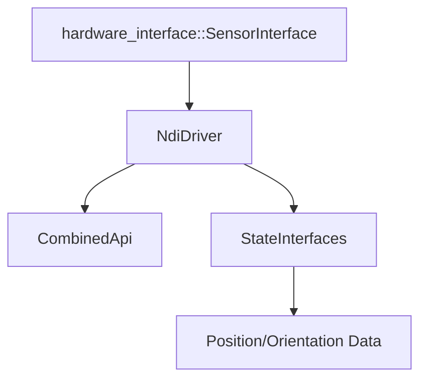

# NDI Driver Package

## Table of Contents

1. [Overview](#overview)
2. [Architecture](#architecture)
    - [Component Structure](#component-structure)
    - [Class Hierarchy](#class-hierarchy)
3. [Dependencies](#dependencies)
    - [Required Packages](#required-packages)
    - [Hardware Requirements](#hardware-requirements)
4. [Installation](#installation)
5. [Hardware Interface](#hardware-interface)
    - [State Interfaces](#state-interfaces)
    - [Lifecycle Management](#lifecycle-management)
6. [API Integration](#api-integration)
    - [CAPI Integration](#capi-integration)
    - [Protocol Support](#protocol-support)
7. [State Management](#state-management)
    - [Initialization](#initialization)
    - [Runtime States](#runtime-states)
8. [Configuration](#configuration)
    - [Parameter Schema](#parameter-schema)
    - [SROM Management](#srom-management)
9. [Building](#building)
    - [CMake Configuration](#cmake-configuration)
10. [Usage](#usage)
    - [Basic Usage](#basic-usage)
    - [Example Launch](#example-launch)
    - [Runtime Control](#runtime-control)
11. [Technical Details](#technical-details)
    - [Coordinate Systems](#coordinate-systems)
    - [Performance](#performance)
    - [Error Handling](#error-handling)
12. [Troubleshooting](#troubleshooting)
    - [Common Issues](#common-issues)
    - [Debugging Tools](#debugging-tools)
    - [Logging](#logging)

## Overview

The NDI Driver package (`ndi_driver`) provides the core hardware interface implementation for NDI tracking systems. It encapsulates the NDI Combined API (CAPI) and provides a ROS2-compatible interface through `hardware_interface::SensorInterface`. The driver supports both BX and BX2 tracking protocols and provides real-time tracking data acquisition and tool management.

## Architecture

### Component Structure

```plaintext
ndi_driver/
├── include/
│   └── ndi_driver/
│       ├── ndi_driver.hpp      # Main driver interface
│       └── visibility_control.h # Symbol visibility
├── src/
│   └── ndi_driver.cpp          # Implementation
├── external/
│   └── ndi_capi/              # NDI API integration
└── CMakeLists.txt             # Build configuration
```

### Class Hierarchy



## Dependencies

### Required Packages

```xml
<depend>hardware_interface</depend>
<depend>pluginlib</depend>
<depend>rclcpp</depend>
<depend>rclcpp_lifecycle</depend>
<depend>ndi_msgs</depend>
<depend>ament_index_cpp</depend>
<depend>yaml_cpp_vendor</depend>
```

### Hardware Requirements

- NDI Tracking System (Polaris/Aurora)
- Ethernet/Serial Connection
- Supported Tool ROMs

## Installation

1. Add the package to your workspace:

    ```bash
    cd /path/to/your/ros2_ws/src
    git clone https://github.com/Needle-NDI-Project/ndi_sys.git
    ```

2. Install dependencies:

    ```bash
    rosdep install --from-paths src --ignore-src -r -y
    ```

3. Build the package:

    ```bash
    colcon build --packages-select ndi_driver
    ```

## Hardware Interface

### State Interfaces

The driver provides the following state interfaces for each tracker:

```cpp
state_interfaces.emplace_back(hardware_interface::StateInterface(
    info_.sensors[i].name, "pose.position.x", &tracker_poses_[i][0]));
state_interfaces.emplace_back(hardware_interface::StateInterface(
    info_.sensors[i].name, "pose.position.y", &tracker_poses_[i][1]));
// ... and so on for all pose components
```

### Lifecycle Management


## API Integration

### CAPI Integration

```cpp
class NdiDriver {
private:
    CombinedApi api_;
    bool supports_bx2_{false};

    // Tool management
    std::vector<ToolData> enabled_tools_;
    std::vector<PortHandleInfo> port_handles_;
};
```

### Protocol Support

1. BX Protocol (Legacy)

    ```cpp
    auto data = api_.getTrackingDataBX(
        TrackingReplyOption::TransformData |
        TrackingReplyOption::AllTransforms);
    ```

2. BX2 Protocol (Modern)

    ```cpp
    auto data = api_.getTrackingDataBX2(
        "--6d=tools --3d=tools --sensor=none --1d=none");
    ```

## State Management

### Initialization

```cpp
hardware_interface::CallbackReturn on_init(
    const hardware_interface::HardwareInfo &info)
{
    // Load configuration
    ip_address_ = info_.hardware_parameters.at("ndi_ip");
    num_tools_ = info_.sensors.size();

    // Connect and configure
    if (api_.connect(ip_address_) != 0) {
        return CallbackReturn::ERROR;
    }

    // Initialize tools
    loadTools();
    initializeTools();

    return CallbackReturn::SUCCESS;
}
```

### Runtime States

1. Data Acquisition
2. Tool Management
3. Error Handling
4. Recovery Procedures

## Configuration

### Parameter Schema

```yaml
hardware_parameters:
  ndi_ip: "192.155.1.80"

sensors:
  - name: "tracker1"
    parameters:
      srom: "tool1.rom"
  - name: "tracker2"
    parameters:
      srom: "tool2.rom"
```

### SROM Management

```cpp
std::string findSromPath(const std::string &srom_name)
{
    return ament_index_cpp::get_package_share_directory("ndi_description")
           + "/srom/" + srom_name;
}
```

## Building

### CMake Configuration

```cmake
# External libraries (NDI CAPI)
add_library(
    ndicapi_library
    SHARED
    ${NDICAPI_LIBRARY_SRC}
)

# Main library (NDI Driver)
add_library(
    ${PROJECT_NAME}
    SHARED
    src/ndi_driver.cpp
)
```

## Usage

### Basic Usage

1. Configure hardware parameters
2. Launch the system
3. Monitor tracking data

### Example Launch

```bash
ros2 launch ndi_bringup ndi_system.launch.py
```

### Runtime Control

```bash
# Check hardware status
ros2 control list_hardware_interfaces
```

## Technical Details

### Coordinate Systems

- Device Coordinates: Millimeters
- ROS Coordinates: Meters
- Orientation: Quaternions [w, x, y, z]

### Performance

- Update Rate: 60Hz typical
- Latency: ~16ms
- Position Accuracy: 0.25mm RMS
- Orientation Accuracy: 0.1° RMS

### Error Handling

```cpp
void onError(const std::string &method, int code)
{
    if (code < 0) {
        RCLCPP_ERROR(
            rclcpp::get_logger("NdiDriver"),
            "%s failed: %s",
            method.c_str(),
            api_.errorToString(code).c_str());
    }
}
```

## Troubleshooting

### Common Issues

1. Connection Failures

    ```plaintext
    Error: Failed to connect to device at 192.155.1.80
    Solution:
    - Check IP address configuration
    - Verify network connectivity
    - Ensure device power
    ```

2. SROM Loading Errors

    ```plaintext
    Error: Could not find SROM file: tool.rom
    Solution:
    - Verify SROM file path
    - Check file permissions
    - Validate SROM file integrity
    ```

3. Tracking Issues

    ```plaintext
    Error: No tools enabled
    Solution:
    - Check tracker visibility
    - Verify tool configuration
    - Validate ROM files
    ```

### Debugging Tools

```bash
# Hardware interface status
ros2 control list_hardware_interfaces

# Parameter verification
ros2 param list /controller_manager
```

### Logging

```bash
# Enable debug logging
ros2 run ndi_driver ndi_driver_node --ros-args --log-level debug
```
